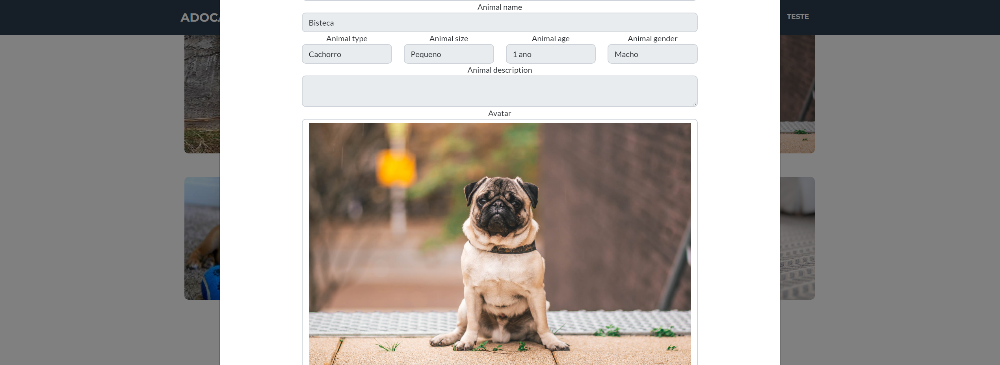

# Adocão - Sistema de adoção de animais

  <h2> Página inicial </h2>
  

  <h2> Quero adotar </h2>
  

  <h2> Prévia do animal </h2>
  

  <h2> Informações do animal </h2>
  

  <h2> Criar usuário </h2>
  

  <h2> Login </h2>
  

  <h2> Cadastrando animal </h2>
  

## Introdução 

  O intuito desse sistema é ser um facilitador na adoção de um animal de estimação(gato e cachorro), o sistema
vai conter cadastro de usuário, onde cada usuário pode cadastrar um ou mais animais para adoção.O usuário terá 
as funções de cadastrar novos animais, editar animais e excluir animais.

## Informações sobre o sistema:

* Ruby version - 2.5.9

* Rails - 5.2.8

* Database - PostgreSQL
